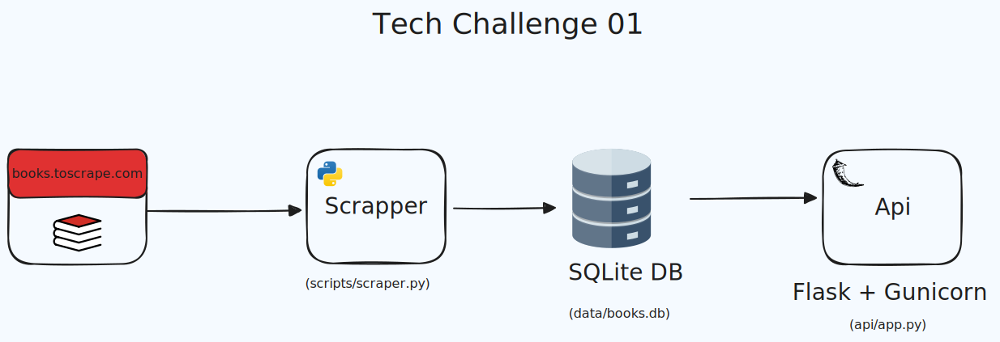

# 📖  Books Api | FIAP Tech Challenge #01 


## 💻 Descrição do Projeto

Este projeto foi desenvolvido para o **Tech Challenge #01** da Pós-Graduação em  **Machine Learning Engineering** da FIAP. 

Seu objetivo é demonstrar um pipeline de dados *end to end*, desde a extração de dados do site [books.toscrape.com](http://books.toscrape.com/) utilizando web scraping, até sua exposição através de uma API. 

Abordando desde a coleta, o tratamento, o armazenamento dos dados e sua disponibilização para consumo.

## ⭐ Tecnologias Utilizadas

* **Backend**: Python 3.10+, Flask
* **Servidor WSGI**: Gunicorn
* **Banco de Dados**: SQLite
* **Web Scraping**: Requests, BeautifulSoup4
* **Documentação da API**: Flasgger (Swagger UI)
* **Autenticação**: JWT (JSON Web Tokens) com `Flask-JWT-Extended`
* **Variáveis de Ambiente**: `python-dotenv`

## 🏢 Arquitetura



A arquitetura da aplicação é composta por três componentes principais:

1.  **Scraper**:  Responsável por extrair os dados brutos da fonte [books.toscrape.com](http://books.toscrape.com/), coletando informações detalhadas de cada livro, e armazenando no banco de dados. \
Disponível em: (`scripts/scraper.py`)

2.  **Banco de Dados**: Banco de dados **SQLite**, responsável por armazenar todas as informações referentes ao livros, atuando como fonte única de dados . \
Disponível em: (`data/books.db`)

3.  **API**: Api Flask, rodando num servidor Gunicorn, expõe uma série de endpoints para consulta dos dados disponíveis no banco.
Disponível em: (`api/app.py`)

## ⚙️ Instalação e Configuração

### Pré-requisitos
* Python 3.10 ou superior
* *pip* (Gerenciador de pacotes do Python)
* Git

### Passo a passo

1.  **Clone o repositório:**
    ```bash
    git clone https://github.com/TheElectron/tech-challenge-api.git
    cd tech-challenge-api
    ```

2.  **Ative o ambiente virtual:**  
* No Windows:  
    ```bash
    python -m venv venv
    .\venv\Scripts\activate
    ```

* No macOS/Linux:
    ```bash
    python -m venv venv
    source venv/bin/activate
    ``` 
    

3.  **Instale as dependências:**
    ```bash
    pip install -r requirements.txt
    ```

4.  **Configure as variáveis de ambiente:**  
    Crie um arquivo chamado `.env` na raiz do projeto e adicione a chave JWT.
    ```
    JWT_SECRET_KEY='seu_valor_secreto_e_dificil_de_adivinhar_aqui'
    ```
    Sugestão, utilize o comando.
    ```bash
    python3 -c "import secrets; print(secrets.token_hex(32))"
    ```

5. **Rode a Api localmente:**  
    Para executar a API usando o Gunicorn:
    ```bash
    gunicorn --config gunicorn.conf.py "api.app:create_app()"
    ```
    A API estará disponível em http://127.0.0.1:8000/api/v1/.  
    Você também pode interagir com a versão disponivel online,
    em https://tech-challenge-api-vjl1.onrender.com/api/v1/.


## 📗 Swagger UI (Documentação Interativa)

Fonte primária de documentação para a API, gerada automaticamente pelo Flasgger. Através dela, é possível ver todos os endpoints em detalhes, seus parâmetros, schemas de request e response, além de **executar chamadas de teste em tempo real** diretamente do seu navegador. \
Disponivel online em: https://tech-challenge-api-vjl1.onrender.com/apidocs/.

## 📖 Documentação das Rotas

Para mais detalhes, consulte a documentação interativa.

| Método | Endpoint | Descrição | Autenticação |
| :--- | :--- | :--- | :--- |
| `GET` | `/` | Retorna a página inicial de boas-vindas da API (HTML). | Não |
| `GET` | `/api/v1/health` | Verifica a saúde da API e a conectividade com o banco de dados. | Não |
| `GET` | `/api/v1/livros` | Lista todos os livros de forma paginada. | Não |
| `GET` | `/api/v1/livros/<id>` | Busca um livro específico pelo seu `id` numérico. | Não |
| `GET` | `/api/v1/livros/filter/price` | Filtra os livros por uma faixa de preço. Aceita query params `?min` e `?max`. | Não |
| `GET` | `/api/v1/categories` | Retorna uma lista com todas as categorias de livros únicas. | Não |
| `GET` | `/api/v1/livros/stats` | Retorna estatísticas (contagem e preço médio) agrupadas por categoria. | Não |
| `GET` | `/api/v1/livros/stats/overview` | Retorna um resumo com estatísticas gerais de todos os livros. | Não |
| `POST` | `/api/v1/trigger-scrape` | Inicia o processo de web scraping em segundo plano (operação assíncrona). | Sim (JWT) |


## 🚀 Entregaveis

- Descrição completa do projeto ✅
- ⁠Diagrama visual do projeto ✅
- [Link do deploy](https://tech-challenge-api-vjl1.onrender.com/api/v1/) ✅ 
- [Link do vídeo](https://drive.google.com/drive/folders/12yRYJUiJujpUMznBTROywDhfxgMcZA0G?usp=sharing)  ✅ 
